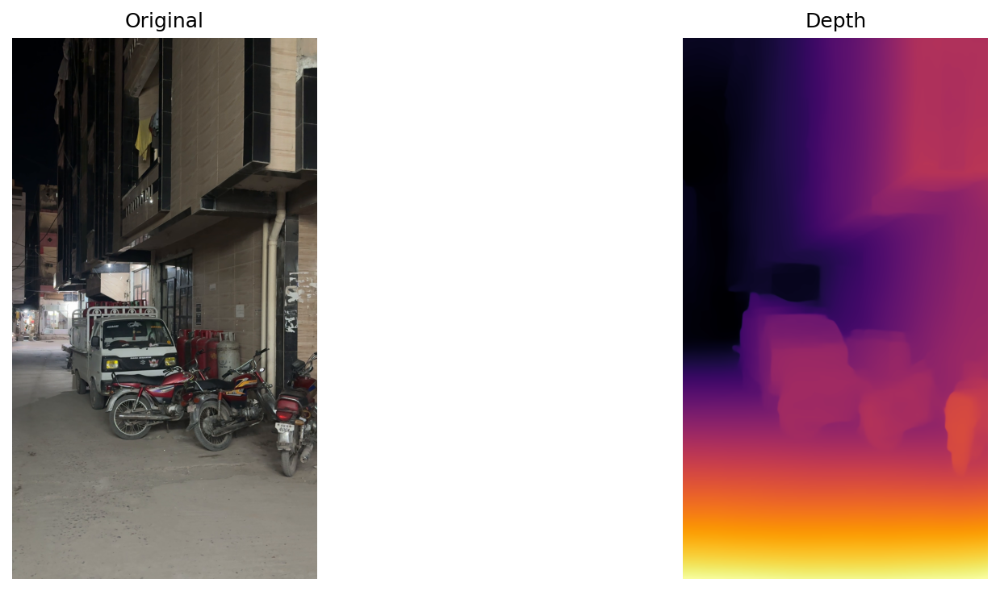

<div align="center">

# 🔍 Monocular Depth Estimation with MiDaS

**Estimate depth from a single RGB image or video using Intel's MiDaS model**

[](https://colab.research.google.com/github/retroqasim/monocular-depth-estimation/blob/main/Monocular_Depth_Estimation_MiDaS.ipynb)
[](https://www.python.org/downloads/)
[](https://pytorch.org/)
[](LICENSE)


*Original image (left) vs. predicted depth map (right) using the `DPT_Large` model*

</div>

---

## 📖 Overview

This project performs **monocular depth estimation** — predicting a dense depth map from a single 2D image — using Intel's [MiDaS](https://github.com/isl-org/MiDaS) (Mixing Datasets for Monocular Depth Estimation) model via PyTorch Hub.

The notebook supports:
- **Single image** depth estimation with side-by-side visualization
- **Batch processing** of entire image folders
- **Video depth estimation** with frame-by-frame processing and MP4 output
- Automatic saving of all results to **Google Drive**

## ✨ Features

| Feature | Description |
|---|---|
| 🖼️ **Single Image** | Upload any image and get an instant depth map |
| 📂 **Batch Processing** | Process all images in a folder in one run |
| 🎬 **Video Support** | Frame-by-frame depth estimation on video files |
| 🎨 **Inferno Colormap** | Beautiful heat-map style depth visualization |
| 💾 **Auto-Save** | Results saved automatically to Google Drive |
| ⚡ **GPU Accelerated** | Runs on CUDA-enabled GPUs (T4, V100, etc.) |

## 🖼️ Sample Results

<div align="center">

### Image Depth Estimation

<table>
<tr>
<td></td>
<td></td>
</tr>
<tr>
<td align="center"><em>Outdoor scene — Golden Gate Bridge</em></td>
<td align="center"><em>Indoor scene — Potted plant</em></td>
</tr>
</table>

### Video Depth Estimation (Sample Frame)



*Frame extracted from video depth estimation — street scene at night*

</div>

## 🚀 Quick Start

### 1. Open in Google Colab

Click the badge below to open the notebook directly in Colab:

[](https://colab.research.google.com/github/retroqasim/monocular-depth-estimation/blob/main/Monocular_Depth_Estimation_MiDaS.ipynb)

> **Note:** After opening, update the Colab badge link in this README to point to your actual notebook URL:
> `https://colab.research.google.com/github/retroqasim/monocular-depth-estimation/blob/main/Monocular_Depth_Estimation_MiDaS.ipynb`

### 2. Enable GPU Runtime

Navigate to **`Runtime → Change runtime type → GPU (T4)`** for optimal performance.

### 3. Run All Cells

Execute the notebook cells in order. The notebook will:
1. Mount your Google Drive for saving results
2. Load the MiDaS `DPT_Large` model from PyTorch Hub
3. Define the depth estimation function
4. Process your images/videos

### 4. Set Your Input Path

Update the path variable in the relevant cell:

```python
# For single image
IMAGE_PATH = '/content/your_image.jpg'

# For batch processing
IMAGE_FOLDER = '/content/images'

# For video
VIDEO_PATH = '/content/your_video.mp4'
```

## 🧠 Model Variants

MiDaS offers three model variants with different accuracy/speed trade-offs:

| Model | Resolution | Parameters | Quality | Speed |
|---|---|---|---|---|
| `DPT_Large` | 384 × 384 | ~344M | ⭐⭐⭐⭐⭐ | 🐢 Slower |
| `DPT_Hybrid` | 384 × 384 | ~123M | ⭐⭐⭐⭐ | 🐇 Moderate |
| `MiDaS_small` | 256 × 256 | ~21M | ⭐⭐⭐ | 🚀 Fastest |

To switch models, change the `MODEL_TYPE` variable in the notebook:

```python
MODEL_TYPE = 'DPT_Large'      # Best quality (default)
MODEL_TYPE = 'DPT_Hybrid'     # Balanced
MODEL_TYPE = 'MiDaS_small'    # Fastest
```

## 📁 Project Structure

```
monocular-depth-estimation/
├── Monocular_Depth_Estimation_MiDaS.ipynb   # Main notebook
├── results/                                  # Sample output results
│   ├── t1_side_by_side.png                  # Outdoor scene result
│   ├── t2_side_by_side.png                  # Indoor scene result
│   └── IMG_3996_frame_2.png                 # Video frame result
├── requirements.txt                          # Python dependencies
├── LICENSE                                   # MIT License
├── CONTRIBUTING.md                           # Contribution guidelines
└── README.md                                 # This file
```

## 📦 Requirements

- Python 3.8+
- PyTorch 2.0+ (with CUDA support recommended)
- OpenCV, NumPy, Matplotlib

All dependencies are pre-installed on Google Colab. For local usage:

```bash
pip install -r requirements.txt
```

## ⚙️ Video Processing Options

Fine-tune video processing with these parameters:

```python
SKIP = 1          # 0 = every frame, 1 = every 2nd, 2 = every 3rd, ...
MAX_FRAMES = 200  # Maximum frames to process (None = all frames)
```

## 🔬 How It Works

1. **Input**: A single RGB image is fed into the MiDaS model
2. **Backbone**: The DPT (Dense Prediction Transformer) encoder extracts multi-scale features
3. **Prediction**: The decoder produces a relative inverse depth map
4. **Post-processing**: The output is normalized to `[0, 255]` and interpolated to the original resolution
5. **Visualization**: The depth map is colorized using the `inferno` colormap for intuitive visualization

```
Input Image → DPT Encoder → Depth Decoder → Normalize → Colorize → Output
```

## 📚 References

- **MiDaS Paper**: [Towards Robust Monocular Depth Estimation](https://arxiv.org/abs/1907.01341) — Ranftl et al., 2020
- **DPT Paper**: [Vision Transformers for Dense Prediction](https://arxiv.org/abs/2103.13413) — Ranftl et al., 2021
- **Official Repository**: [isl-org/MiDaS](https://github.com/isl-org/MiDaS)
- **PyTorch Hub**: [MiDaS on PyTorch Hub](https://pytorch.org/hub/intelisl_midas_v2/)

## 🤝 Contributing

Contributions are welcome! Please read the [Contributing Guidelines](CONTRIBUTING.md) for details on how to submit pull requests, report issues, and suggest improvements.

## 📄 License

This project is licensed under the **MIT License** — see the [LICENSE](LICENSE) file for details.

## 🙏 Acknowledgments

- [Intel ISL](https://github.com/isl-org) for the MiDaS model
- [Google Colab](https://colab.research.google.com/) for providing free GPU access
- The open-source computer vision community

---

<div align="center">

**⭐ If you found this project useful, please consider giving it a star! ⭐**

</div>
